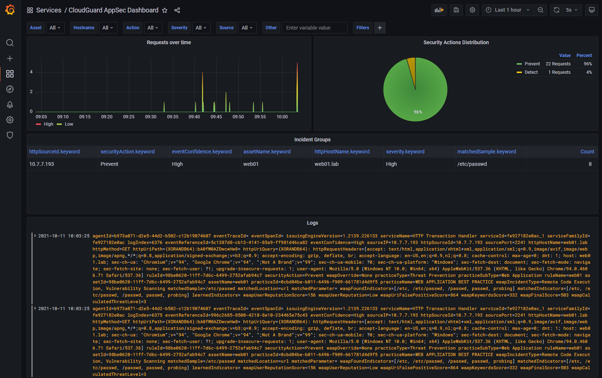
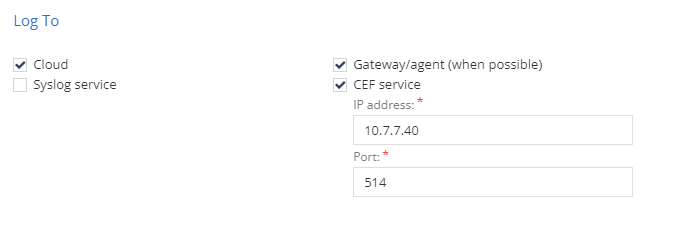

# AppSec-Monitoring
Docker solution based on fluent-bit, grafana and elasticsearch for creating a customized AppSec dashboard.

## Getting started

- Clone this repository

    ```git clone https://github.com/chkp-sdeboer/appsec-monitoring.git```

- Go to the created folder

    ```cd appsec-monitoring```

- Start the application with docker compose

    ```docker-compose up -d```

- Wait a few minutes, and visit your docker host on port 3000, e.g.:

    ```http://docker-host:3000/```

- Log into Grafana as admin/admin
- Create a new password
- Go to Dashboards - Manage and choose Services.
- Select CloudGuard AppSec Dashboard

## Screenshot



# Requirements
Configure your AppSec environment to have a trigger sending CEF messages to your Docker environment. 

For example:



# Note
This is work in progress.