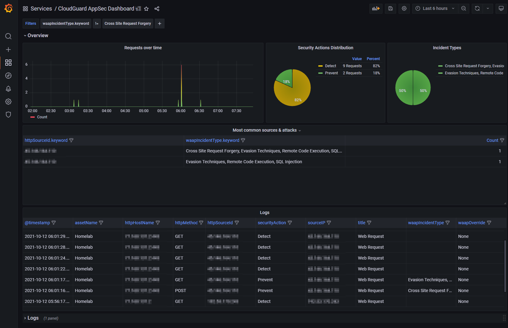

# AppSec-Monitoring
Docker solution based on fluent-bit, grafana and elasticsearch for creating a customized AppSec dashboard.

## Screenshot

# Requirements
Configure your AppSec environment to have a trigger sending CEF messages to your Docker environment. 

For example:

# Note
This is work in progress.